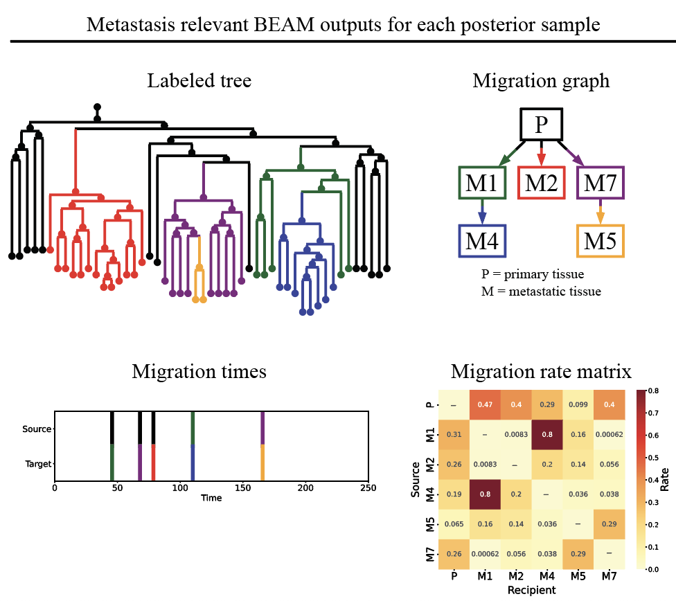

# BEAM Visualization

A Python package for visualizing and analyzing [BEAM (Bayesian Evolutionary Analysis of Metastasis)](https://github.com/StephenStaklinski/beam) output.

<div style="text-align: left;">
  
</div>

## Installation

You can install the package using pip:

```bash
git clone https://github.com/StephenStaklinski/beam_visualization.git
cd beam_visualization
pip install -e .
```


## Basic Usage

```python
import beam_visualization

# Initialize with BEAM output files
results = beam_visualization.BeamResults(
    "examples/data/example.trees", 
    "examples/data/example.log", 
    primary_tissue="LL",
    total_time=54
    )

# Get information about the loaded data
results.info()

# List available parameters
parameters = results.get_parameters()

# Get statistics for a parameter
results.get_parameter_stats(
    parameters[10]
    )

# Plot parameter distributions
results.plot_parameters(
    parameter = parameters[10], 
    output_file = "examples/output/param.pdf"
    )

# Plot the mean rate matrix as a heatmap
results.plot_rate_matrix(
    output_file = "examples/output/rate_matrix.pdf"
)

# Get consensus graph
results.get_consensus_graph(
    output_file = "examples/output/probability_graph.csv"
    )

# Plot consensus graph with probability weighted edges
results.plot_probability_graph(
    output_file="examples/output/probability_graph.pdf"
    )

# Plot consensus graph with edges above threshold included
results.plot_thresholded_graph(
    threshold=[0.5, 0.75, 0.90], 
    output_file_prefix="examples/output/thresholded_graph"
    )

# Calculate mutual information based on a migration count matrix from traversing the posterior trees
results.compute_posterior_mutual_info(
    output_file_matrix = "examples/output/mutual_info_matrix.csv", 
    output_file_information = "examples/output/mutual_info.txt"
    )

# Sample and plot individual posterior tree samples as tree, graph, and timing plots
results.sample_and_plot_trees(
    n=2,
    output_prefix="examples/output/posterior_tree_sample"
)

# Record and plot metastasis times across all posterior samples
metastasis_times = results.get_metastasis_times(
    output_prefix="examples/output/metastasis_timing"
)
```

## Testing

```bash
# Install the package with test dependencies
pip install -e ".[test]"

# Run all tests
pytest --cov=beam_visualization --cov-report=term-missing
```

## License

This project is licensed under the MIT License.

